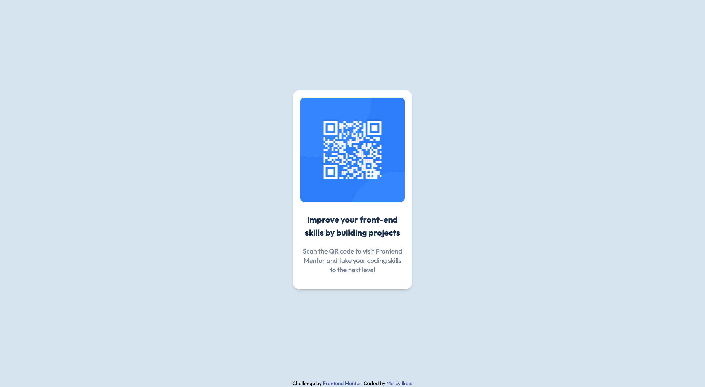

# Frontend Mentor - QR code component solution

This is a solution to the [QR code component challenge on Frontend Mentor](https://www.frontendmentor.io/challenges/qr-code-component-iux_sIO_H). Frontend Mentor challenges help you improve your coding skills by building realistic projects.

## Table of contents

- [Overview](#overview)
    - [Screenshot](#screenshot)
    - [Links](#links)
- [My process](#my-process)
    - [Built with](#built-with)
- [Author](#author)

## Overview

### Screenshot of the project

### Links

- Solution URL: [https://github.com/mercyikpe/qr-code-component](https://github.com/mercyikpe/qr-code-component)
- Live Site URL: [https://mercyikpe.github.io/qr-code-component/](https://mercyikpe.github.io/qr-code-component/)

## My process

### Built with

- Semantic HTML5 markup
- Mobile-first workflow
- [Tailwind CSS](https://tailwindcss.com/) - For styles

## Author

- Website - [https://mercyikpe.vercel.app/](https://mercyikpe.vercel.app/)
- Frontend Mentor - [@mercyikpe](https://www.frontendmentor.io/profile/mercyikpe)
- Twitter - [@mercy_ikpe](https://twitter.com/mercy_ikpe)